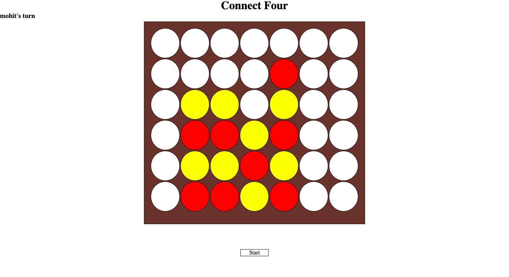

# connect-four
Connect four game
## Description
This is a simple connect four game build using html, css, javascript and jquery. Once the page loads
two alerts are shown to enter players name. Yellow always goes first or every valid odd move.
Red always goes second or every valid even move. When four dots are connected, could be horizontally
or vertically or diagonally then that player wins the game.

*This app is deployed on Netlify for some time link to the same is* https://heuristic-ardinghelli-6cfb15.netlify.app/

On clicking start button at the bottom the game starts and if clicked when the game is being played
it resets the game. Also with every move the player who takes the next turn is shown. There are 
three possible outcomes to a game, player 1 wins, player 2 wins or the game ends in a draw.
The game looks like this 
 
